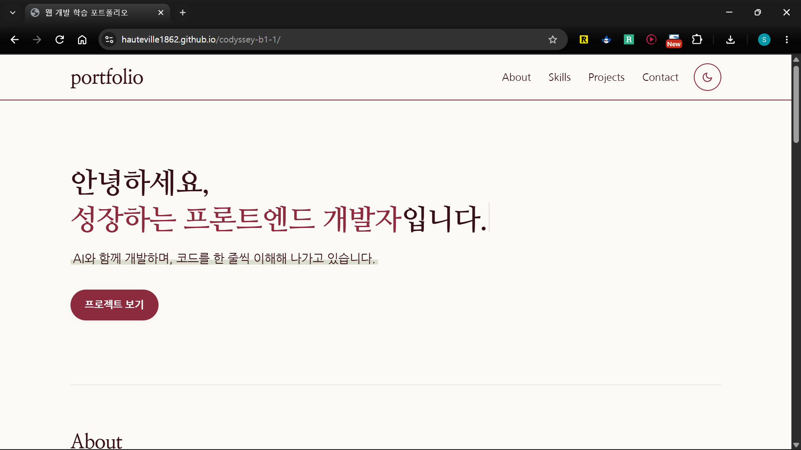

# 나를 소개하는 웹페이지 — 개발자 포트폴리오

> **💡 웹 개발의 황금 법칙**  
> **"HTML(뼈대)을 먼저 세우고 → CSS(모양·배치)를 입힌 뒤 → JavaScript(기능·API)를 붙인다."**

## 프로젝트 소개

HTML, CSS, JavaScript만으로 만든 반응형 포트폴리오 웹사이트입니다.  
외부 라이브러리 없이 "사용자 이벤트 → 상태 변경 → DOM 업데이트" 흐름을 직접 구현합니다.

### 사용 기술

- HTML5 (시맨틱 마크업)
- CSS3 (CSS 변수, Flexbox, Grid, 미디어 쿼리)
- Vanilla JavaScript (ES6+)
- GitHub REST API (`fetch` + `async/await`)
- Google Fonts (나눔고딕, 나눔명조)

### 주요 기능

| 기능 | 설명 |
|:---|:---|
| 반응형 레이아웃 | 모바일 퍼스트, 768px(태블릿), 1024px(데스크톱) 브레이크포인트 |
| 다크 모드 | 토글 버튼으로 전환, localStorage에 설정 저장 |
| 햄버거 메뉴 | 모바일에서 ☰ 버튼으로 네비게이션 열기/닫기 |
| 부드러운 스크롤 | CSS `scroll-behavior: smooth` |
| 스크롤 탑 버튼 | 스크롤 **300px** 이상에서 표시, 클릭 시 맨 위로 이동 |
| 네비게이션 스타일 변경 | 스크롤 **60px** 이상에서 헤더 배경색 변경 + 그림자 추가 |
| 스크롤 애니메이션 | Intersection Observer (threshold: **0.2**) |
| 폼 유효성 검사 | 빈칸 검증, 이메일 `이름@도메인.확장자` 형식 검증, 필드별 에러 메시지, 실시간 `input` 검증 |
| GitHub API 연동 | 저장소 목록 동적 렌더링, 로딩/성공/에러/빈 상태 UI |

### 배포 URL

🔗 **[GitHub Pages 배포 사이트 바로가기](https://hauteville1862.github.io/b1-1/)**  
*(저장소 Settings → Pages 활성화 후 접속 가능)*

### 스크린샷

| 데스크톱 화면 (1024px+) | 모바일 화면 (<768px) | 다크 모드 화면 |
| :---: | :---: | :---: |
|  |  |  |
| *데스크톱 기본 뷰* | *모바일 햄버거 메뉴 뷰* | *다크 모드 테마 뷰* |

> 💡 **스크린샷 등록 방법**: 위 경로(`images/screenshot-desktop.png`, `images/screenshot-mobile.png`, `images/screenshot-dark.png`)로 캡처 이미지를 저장하면 자동으로 표시됩니다.

### 상태 관리 패턴 ("이벤트 → 상태 변경 → 화면 업데이트")

| 구분 | 사용자 이벤트 | 상태 변경 | 화면 업데이트 |
| :--- | :--- | :--- | :--- |
| **다크 모드** | 테마 토글 버튼 클릭 | 테마 상태(`dark` ↔ `light`) 전환, `localStorage` 갱신 | `data-theme` 속성 변경, 전체 컬러 팔레트 및 아이콘 전환 |
| **외부 API** | 페이지 로드 / 재시도 클릭 | 비동기 API 요청 상태(`loading` → `success` / `error` / `empty`) | 로딩 스피너 → 카드 그리드 / 에러 안내 / 빈 화면 동적 렌더링 |
| **폼 검증** | 입력값 변경(`input`) / 제출(`submit`) | 필드별 유효성 상태(`valid` ↔ `invalid`) | 에러 메시지 실시간 노출/제거, `aria-invalid` 갱신, 완료 문구 표시 |
| **필터링 (보너스)** | 언어별 필터 버튼 클릭 | `currentFilter` 상태 변경 (`All`, 언어명, `Other`) | 해당 언어 프로젝트 카드만 필터링하여 재렌더링, 활성 버튼 표시 |

---

## 제작 체크리스트

### 1단계: 프로젝트 기본 세팅 & 환경 구축

| ✅ | 작업 내용 | 핵심 요건 |
| :---: | :--- | :--- |
| ✅ | 프로젝트 폴더 및 파일 생성 | • `index.html` (메인 페이지) • `css/style.css`, `js/script.js` • `images/` 폴더 분리 |
| ✅ | 파일 연결 | • CSS: `<link>` 태그로 연결 • JS: `defer` 속성 적용하여 연결 |
| ✅ | Live Server 설치 및 실행 | • `http://127.0.0.1:5500/index.html` 실행 확인 |
| ✅ | 실시간 새로고침 확인 | • 파일 저장 후 브라우저에 변경 내용이 자동 반영됨을 확인 |

---

### 2단계: HTML 시맨틱 뼈대 작성

| ✅ | 작업 내용 | 핵심 요건 |
| :---: | :--- | :--- |
| ✅ | 시맨틱 태그 구조화 | • `<header>`, `<nav>`, `<main>` 사용 • `<section>`, `<footer>` 영역 분리 |
| ✅ | Hero 섹션 작성 | • 인사말 • CTA(행동 유도) 버튼 |
| ✅ | About 섹션 작성 | • 자기소개 본문 작성 • 프로필 이미지 (`alt` 속성 필수) |
| ✅ | Skills 섹션 작성 | • 보유 기술 스택 목록 나열 • HTML, CSS, JavaScript 등 |
| ✅ | Projects 섹션 컨테이너 준비 | • API 결과 카드가 들어갈 빈 구역 • 동적 렌더링용 컨테이너 id 부여 |
| ✅ | Contact 섹션 폼 작성 | • 이름, 이메일, 메시지 입력창 • `<label>` for-id 연결 |
| ✅ | Footer 섹션 작성 | • 저작권 표기 (© 2026) • 소셜 미디어 링크 |
| ✅ | 네비게이션 앵커 링크 연결 | • 앵커 링크 연결 (`#about` 등) • 메뉴 클릭 시 해당 섹션으로 이동 |

---

### 3단계: CSS 스타일링 & 반응형 레이아웃

| ✅ | 작업 내용 | 핵심 요건 |
| :---: | :--- | :--- |
| ✅ | 디자인 시스템 변수 정의 | • `:root` CSS 변수 (색상/폰트/간격) • `[data-theme="dark"]` 다크 모드 변수 |
| ✅ | 모바일 퍼스트 기본 스타일 | • 모바일 화면(좁은 너비) 기준 스타일링 • 작은 화면에서 가독성 확보 |
| ✅ | Flexbox 레이아웃 적용 | • 상단 네비게이션 바 적용 • 로고 좌측, 메뉴 우측 배치 |
| ✅ | Grid 레이아웃 적용 | • Projects 카드 영역 적용 • `auto-fit`, `minmax`로 반응형 카드 배치 |
| ✅ | 반응형 미디어 쿼리 적용 | • 768px 이상: 태블릿 • 1024px 이상: 데스크톱 (메뉴 펼침) |
| ✅ | 시각 효과 스타일링 | • 버튼/카드 hover transition 효과 • 카드 그림자(`box-shadow`) 적용 |

---

### 4단계: JavaScript 인터랙션 (상호작용 구현)

| ✅ | 작업 내용 | 핵심 요건 |
| :---: | :--- | :--- |
| ✅ | 햄버거 메뉴 토글 | • 모바일 ☰ 버튼 클릭 감지 • `classList.toggle`로 열기/닫기 |
| ✅ | 부드러운 스크롤 구현 | • 메뉴 링크 클릭 시 부드럽게 이동 • `scroll-behavior: smooth` |
| ✅ | 스크롤 탑 버튼 구현 | • **300px** 이상 스크롤 시 버튼 표시 • 클릭 시 페이지 최상단 이동 |
| ✅ | 네비게이션 스타일 변경 | • **60px** 이상 스크롤 시 헤더 배경색 변경 + 그림자 |
| ✅ | 스크롤 애니메이션 | • Intersection Observer (threshold: **0.2**) |
| ✅ | 다크 모드 토글 & 상태 유지 | • 테마 전환 토글 버튼 구현 • **localStorage** 저장으로 새로고침 유지 |
| ✅ | Contact 폼 유효성 검사 | • 필수 입력값 빈칸 검증 (3개 필드 모두) • 이메일 `이름@도메인.확장자` 형식 검증 • 필드별 에러 메시지 표시 • `input` 이벤트로 실시간 검증 |

---

### 5단계: GitHub API 연동 & 상태 처리

| ✅ | 작업 내용 | 핵심 요건 |
| :---: | :--- | :--- |
| ✅ | GitHub API 비동기 호출 | • `fetch()` + `async/await` 사용 • `/users/hauteville1862/repos` 엔드포인트 |
| ✅ | 로딩 상태 UI 처리 | • "데이터를 불러오는 중입니다..." 텍스트 표시 |
| ✅ | 성공 상태 UI 처리 | • 받아온 저장소 목록 `map()` + 구조분해 할당으로 순회 • 동적 HTML 카드(`<article>`)로 생성 및 렌더링 |
| ✅ | 빈 상태 UI 처리 | • 등록된 저장소 0개일 때 분기 처리 • "표시할 프로젝트가 없습니다." 안내 표시 |
| ✅ | 에러 상태 UI 및 예외 처리 | • 네트워크 통신 실패 시 에러 메시지 표시 • `try/catch` 예외 처리 • "다시 시도" 재시도 버튼 |

---

### 6단계: 배포 & 최종 검증

| ✅ | 작업 내용 | 핵심 요건 |
| :---: | :--- | :--- |
| ✅ | Git 커밋 및 원격 푸시 | • 전체 소스 코드 Git 커밋 • GitHub 원격 저장소(`origin/main`)에 푸시 완료 |
| [ ] | GitHub Pages 배포 | • 저장소 `Settings → Pages`에서 `main` 브랜치 배포 활성화 • 공개 URL 발급 및 정상 접속 확인 |
| [ ] | 최종 브라우저 교차 검증 | • 최신 Chrome 브라우저에서 인터랙션, API, 폼 검증 동작 확인 • 모바일/태블릿 반응형 및 콘솔 에러 유무 점검 |
| [ ] | 스크린샷 첨부 | • 데스크톱, 모바일, 다크 모드 캡처 후 `images/` 폴더에 추가하여 README 표시 |

---

## 7단계: 보너스 과제 (선택)

| ✅ | 과제 항목 | 세부 요건 |
| :---: | :--- | :--- |
| ✅ | 프로젝트 필터링 | • GitHub 프로젝트 언어별 필터 버튼 제공 • `Array.prototype.filter()` 활용 |
| [ ] | 타이핑 효과 | • Hero 섹션에 타자기처럼 한 글자씩 나타나는 타이핑 애니메이션 구현 |
| [ ] | 폼 실제 전송 | • Formspree 또는 EmailJS 연동으로 실제 문의 이메일 전송 |
| [ ] | 시스템 다크 모드 감지 | • `prefers-color-scheme` 미디어 쿼리로 OS 테마 설정 자동 감지 및 초기 반영 |
