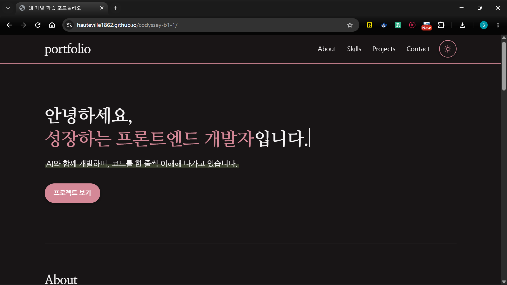
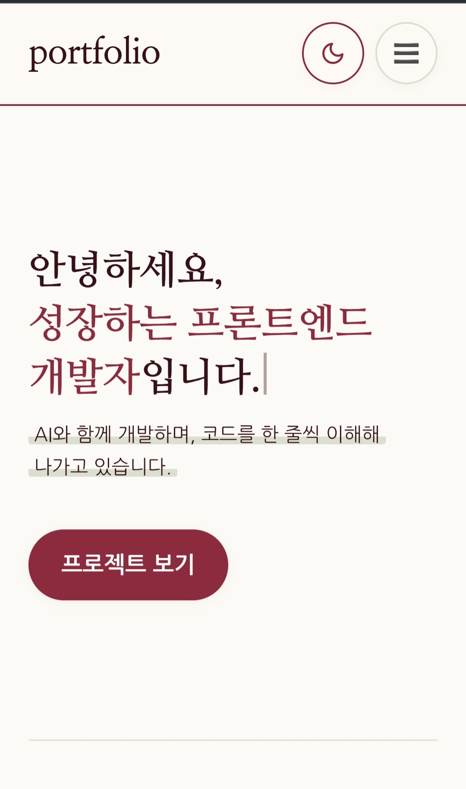
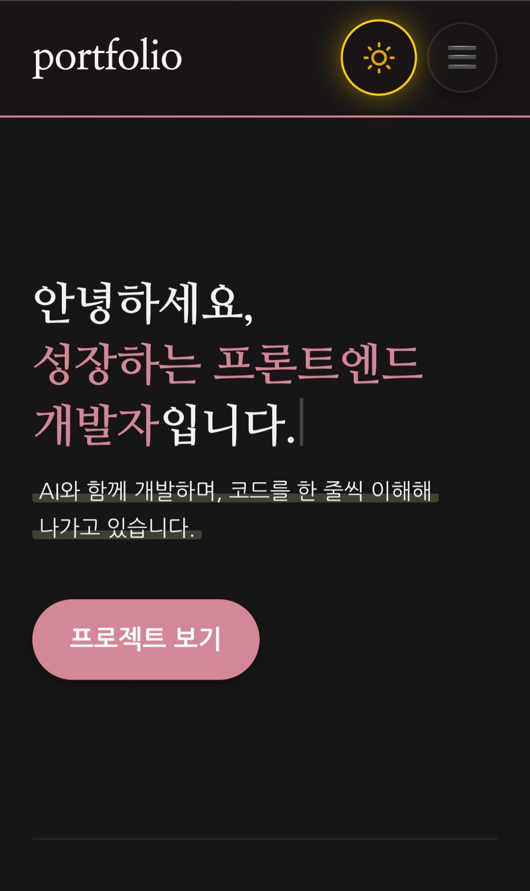

# 나를 소개하는 웹페이지 — 개발자 포트폴리오
test test  

## 프로젝트 소개

HTML, CSS, JavaScript만으로 만든 반응형 포트폴리오 웹사이트입니다.  
외부 라이브러리 없이 "사용자 이벤트 → 상태 변경 → DOM 업데이트" 흐름을 직접 구현합니다.

### 사용 기술

- HTML5 (시맨틱 마크업)
- CSS3 (CSS 변수, Flexbox, Grid, 미디어 쿼리)
- Vanilla JavaScript (ES6+)
- GitHub REST API (`fetch` + `async/await`)
- Git & GitHub Pages (버전 관리 및 정적 웹 배포)
- Google Fonts (나눔고딕, 나눔명조)

### 주요 기능

| 기능 | 설명 |
|:---|:---|
| 반응형 레이아웃 | 모바일 퍼스트, 768px(태블릿), 1024px(데스크톱) 브레이크포인트 |
| 다크 모드 | 토글 버튼으로 전환, localStorage에 설정 저장 |
| 햄버거 메뉴 | 모바일에서 ☰ 버튼으로 네비게이션 열기/닫기 |
| 부드러운 스크롤 | CSS `scroll-behavior: smooth` |
| 스크롤 탑 버튼 | 스크롤 **300px** 이상에서 표시, 클릭 시 맨 위로 이동 |
| 네비게이션 스타일 변경 | 스크롤 **60px** 이상에서 헤더 배경색 변경 + 그림자 추가 |
| 스크롤 애니메이션 | Intersection Observer (threshold: **0.2**) |
| 폼 유효성 검사 | 빈칸 검증, 이메일 `이름@도메인.확장자` 형식 검증, 필드별 에러 메시지, 실시간 `input` 검증 |
| GitHub API 연동 | 저장소 목록 동적 렌더링, 로딩/성공/에러/빈 상태 UI |

### 배포 URL

🔗 **[GitHub Pages 배포 사이트 바로가기](https://hauteville1862.github.io/codyssey-b1-1/)**  
*(배포 완료 및 정상 서빙 확인)*

### 스크린샷

| 화면 구분 | 라이트 모드 (기본 테마) | 다크 모드 (야간 테마) |
| :---: | :---: | :---: |
| **데스크톱** (1024px+) |  |  |
| **모바일** (<768px) |  |  |

> 💡 **스크린샷 안내**: 데스크톱 및 모바일 환경에서 라이트 모드와 다크 모드를 각각 실행한 실제 캡처 화면 4종입니다.

### 상태 관리 패턴 ("이벤트 → 상태 변경 → 화면 업데이트")

| 구분 | 사용자 이벤트 | 상태 변경 | 화면 업데이트 |
| :--- | :--- | :--- | :--- |
| **중앙 상태 관리** | 애플리케이션 전반 | 단일 상태 객체 `STATE` (`theme`, `allRepos`, `currentFilter`, `isLoadingRepos`) | 상태 변경 시 해당 UI 컴포넌트 렌더 함수 실행 |
| **다크 모드** | 테마 토글 버튼 클릭 | `STATE.theme` (`dark` ↔ `light`) 전환, `localStorage` 갱신 | `renderTheme()` 호출, `data-theme` 속성 및 아이콘 전환 |
| **외부 API** | 페이지 로드 / 재시도 클릭 | 비동기 API 요청 상태 (`STATE.isLoadingRepos`, `STATE.allRepos`) | 로딩 스피너 → 카드 그리드 / 에러 안내 / 빈 화면 동적 렌더링 |
| **폼 검증** | 입력값 변경(`input`) / 제출(`submit`) | 필드별 유효성 상태 (`valid` ↔ `invalid`) | 에러 메시지 실시간 노출/제거, `aria-invalid` 갱신, 완료 문구 표시 |
| **필터링 (보너스)** | 언어별 필터 버튼 클릭 | `STATE.currentFilter` 상태 변경 (`All`, 언어명, `Other`) | 해당 언어 프로젝트 카드만 필터링하여 재렌더링, 활성 버튼 표시 |

---

## B1-1 — 나를 소개하는 웹페이지 처음부터 만들기 체크리스트

> **기호 안내**: ✅ 완료 / 충족 | ❌ 미진행 / 추가 작업 필요

### 1. 프로젝트 기본 구성

| 상태 | 세부 항목 | 세부 요건 |
| :---: | :--- | :--- |
| ✅ | 폴더 구조 분리 | • `index.html` (메인 페이지) • `css/` (스타일시트) • `js/` (JavaScript 파일) • `images/` (이미지 파일) |
| ✅ | 외부 파일 연결 | • 외부 스타일시트(`<link rel="stylesheet">`) 연결 • JavaScript 파일(`<script defer>`) 올바르게 연결 |
| ✅ | 개발 환경 구성 | • VS Code + Live Server로 실시간 새로고침 및 개발 환경 구성 |

---

### 2. HTML 구조 (시맨틱 마크업)

| 상태 | 세부 항목 | 세부 요건 |
| :---: | :--- | :--- |
| ✅ | 시맨틱 태그 구조화 | • `div` 남용 지양, `<header>`, `<nav>`, `<main>`, `<section>`, `<article>`, `<footer>` 사용 |
| ✅ | 6대 필수 섹션 포함 | • Hero (인사말, CTA 버튼) • About (자기소개, 프로필 이미지) • Skills (기술 스택 목록) • Projects (GitHub API 연동 카드) • Contact (문의 폼) • Footer (저작권, 소셜 링크) |
| ✅ | 네비게이션 앵커 링크 | • 각 섹션(`#hero`, `#about`, `#skills`, `#projects`, `#contact`)으로 이동하는 앵커 링크 연결 |
| ✅ | 이미지 대체 텍스트 | • 모든 이미지에 의미 있는 `alt` 속성 부여 |
| ✅ | 폼 레이블 연결 | • 폼 요소에 `<label>`이 올바르게 연결 (`for`-`id` 매칭) |

---

### 3. CSS 스타일링 (레이아웃 & 반응형)

| 상태 | 세부 항목 | 세부 요건 |
| :---: | :--- | :--- |
| ✅ | 외부 스타일시트 & CSS 변수 | • 외부 스타일시트(`css/style.css`) 사용 • `:root`에 색상, 폰트, 간격 정의 • `[data-theme="dark"]` 다크 모드 변수 별도 정의 |
| ✅ | 네비게이션 Flexbox | • Flexbox를 활용하여 로고 왼쪽, 메뉴 오른쪽 배치 |
| ✅ | Projects Grid 레이아웃 | • CSS Grid `auto-fit`, `minmax` 기반 반응형 카드 배치 |
| ✅ | 모바일 퍼스트 반응형 디자인 | • 모바일 기본 작성 후 미디어 쿼리(`768px`, `1024px`) 확장 • 모바일 환경에서 메뉴 숨김 및 햄버거 버튼 전환 |
| ✅ | 시각 효과 & 인터랙션 스타일 | • 버튼/카드 hover 효과 및 `transition` 적용 • 프로젝트 카드 `box-shadow` 적용 |

---

### 4. JavaScript 기초 (DOM & 이벤트)

| 상태 | 세부 항목 | 세부 요건 |
| :---: | :--- | :--- |
| ✅ | 스크립트 연결 & 모던 문법 | • `defer` 속성으로 HTML 로드 후 실행 보장 • `var` 대신 `const`, `let`만 사용 |
| ✅ | 이벤트 리스너 바인딩 | • 인라인 `onclick` 없이 `addEventListener`로 이벤트 연결 |
| ✅ | DOM 탐색 및 조작 | • `querySelector`, `querySelectorAll`로 대상 탐색 • `textContent`, `innerHTML`로 내용 변경 • `classList.add`, `remove`, `toggle`로 클래스 제어 |
| ✅ | 이벤트 처리 및 기본 동작 방지 | • `click`, `submit`, `scroll`, `input` 이벤트 처리 • `event.preventDefault()`로 폼 제출/링크 기본 동작 제어 |

---

### 5. 인터랙션 구현 (6대 인터랙션)

| 상태 | 세부 항목 | 세부 요건 |
| :---: | :--- | :--- |
| ✅ | 햄버거 메뉴 토글 | • 모바일 ☰ 버튼 클릭 시 메뉴 열기/닫기 (`classList.toggle('active')`) |
| ✅ | 부드러운 스크롤 | • 메뉴 클릭 시 해당 섹션으로 부드럽게 이동 (`scroll-behavior: smooth`) |
| ✅ | 스크롤 탑 버튼 | • **300px** 이상 스크롤 시 버튼 노출, 클릭 시 최상단 이동 |
| ✅ | 네비게이션 스타일 변경 | • **60px** 이상 스크롤 시 헤더 배경 변경 및 그림자 효과 추가 |
| ✅ | 다크 모드 & 상태 유지 | • 토글 버튼으로 테마 전환, `localStorage`에 저장하여 새로고침 후에도 유지 |
| ✅ | 스크롤 애니메이션 | • Intersection Observer API 활용 (임계값 `threshold: 0.2` 적용) |

---

### 6. 폼 UX

| 상태 | 세부 항목 | 세부 요건 |
| :---: | :--- | :--- |
| ✅ | Contact 폼 구성 | • 이름, 이메일, 메시지 입력 필드 제공 |
| ✅ | 필수값 검증 | • 빈 필드 제출 불가 (3개 필드 모두 검증) |
| ✅ | 이메일 형식 검증 | • `이름@도메인.확장자` 유효 이메일 패턴 검사 |
| ✅ | 에러 메시지 필드 근처 표시 | • 입력 필드 하단(`#name-error`, `#email-error`, `#message-error`)에 즉시 표시 |
| ✅ | 제출 제어 & 완료 메시지 | • `event.preventDefault()`로 새로고침 방지 후 성공 메시지 표시 |

---

### 7. ES6+ 문법 & 배열 메서드

| 상태 | 세부 항목 | 세부 요건 |
| :---: | :--- | :--- |
| ✅ | 화살표 함수 | • 간결하고 명확한 화살표 함수 구문 적극 활용 |
| ✅ | 템플릿 리터럴 | • 백틱(`` ` ``)을 이용한 동적 HTML 카드 템플릿 생성 |
| ✅ | 구조분해 할당 | • API 응답 객체에서 `{ name, html_url, description, language, stargazers_count }` 값 추출 |
| ✅ | 배열 메서드 활용 | • `map`: GitHub 데이터를 카드 HTML 배열로 변환 • `forEach`: DOM 노드 목록 순회 • `filter`: 언어별 필터링 기능에 활용 |

---

### 8. 비동기 처리 & API 연동

| 상태 | 세부 항목 | 세부 요건 |
| :---: | :--- | :--- |
| ✅ | GitHub API 비동기 호출 | • `fetch` + `async/await` 활용 • 엔드포인트: `https://api.github.com/users/hauteville1862/repos` |
| ✅ | 로딩 상태 UI | • 요청 대기 중 "데이터를 불러오는 중입니다..." 로딩 스피너 표시 |
| ✅ | 성공 상태 UI | • 받아온 저장소 카드 목록 동적 렌더링 |
| ✅ | 에러 상태 UI & 재시도 | • `try/catch` 예외 처리, 에러 메시지 노출 및 [다시 시도] 버튼 제공 |
| ✅ | 빈 상태 UI | • 등록된 저장소가 없을 때 "표시할 프로젝트가 없습니다." 안내 표시 |

---

### 9. 상태 관리 패턴 ("이벤트 → 상태 변경 → 화면 업데이트")

| 상태 | 흐름 항목 | 세부 흐름 설명 |
| :---: | :--- | :--- |
| ✅ | 단일 상태 객체 (`STATE`) | `theme`, `allRepos`, `currentFilter`, `isLoadingRepos`를 단일 중앙 상태 객체(`STATE`)로 통합 관리 |
| ✅ | 테마 상태 흐름 | 토글 클릭 → `STATE.theme` 갱신 & 저장 → `renderTheme()` 화면 반영 |
| ✅ | API 요청 상태 흐름 | 페이지 로드/재시도 클릭 → `STATE.isLoadingRepos` 및 API 응답 갱신 → 카드 그리드 동적 렌더링 |
| ✅ | 폼 검증 상태 흐름 | 실시간 `input`/`submit` → 유효성 상태 판단 → 에러 메시지 노출/초기화 및 완료 안내 |
| ✅ | 필터 상태 흐름 | 필터 버튼 클릭 → `STATE.currentFilter` 갱신 → 일치하는 언어 카드만 재렌더링 |

---

### 10. 배포 & 최종 점검

| 상태 | 세부 항목 | 세부 요건 |
| :---: | :--- | :--- |
| ✅ | GitHub Pages 배포 | • GitHub 저장소 `Settings → Pages`에서 `main` 브랜치 배포 활성화 (배포 완료) |
| ✅ | 배포 사이트 정상 동작 검증 | • 배포 URL에서 반응형 레이아웃, 인터랙션, API, 폼 검증 등 전체 동작 확인 |
| ✅ | README 스크린샷 첨부 | • 데스크톱, 모바일, 다크 모드 캡처 후 `images/`에 추가하여 README 표시 (4종 등록 완료) |

---

### 11. 보너스 과제 (선택)

| 상태 | 세부 항목 | 세부 요건 |
| :---: | :--- | :--- |
| ✅ | 프로젝트 필터링 | • GitHub 저장소를 언어별로 필터링하는 버튼 제공 (`Array.prototype.filter()` 활용) |
| ✅ | 타이핑 효과 | • Hero 섹션에 타자기처럼 한 글자씩 나타나고 지워지는 타이핑 애니메이션 구현 |
| ❌ | 폼 실제 전송 | • Formspree 또는 EmailJS 연동을 통해 입력한 문의를 실제 이메일로 전송 |
| ❌ | 시스템 다크 모드 감지 | • `prefers-color-scheme` 미디어 쿼리로 OS 테마 설정을 자동 감지하여 초기 적용 |
